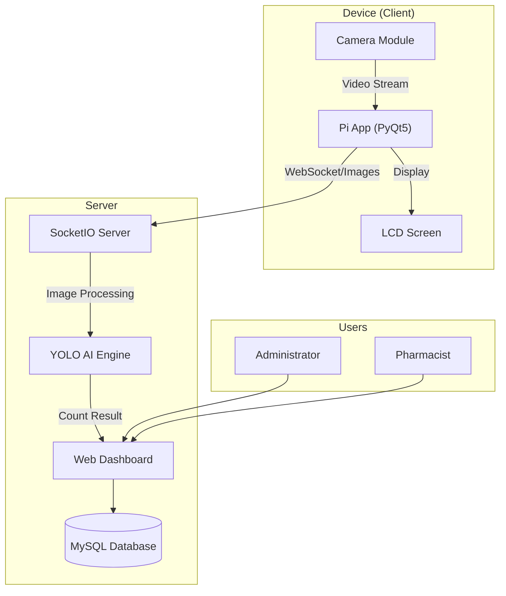
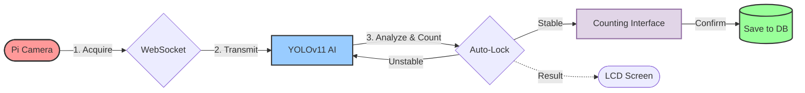
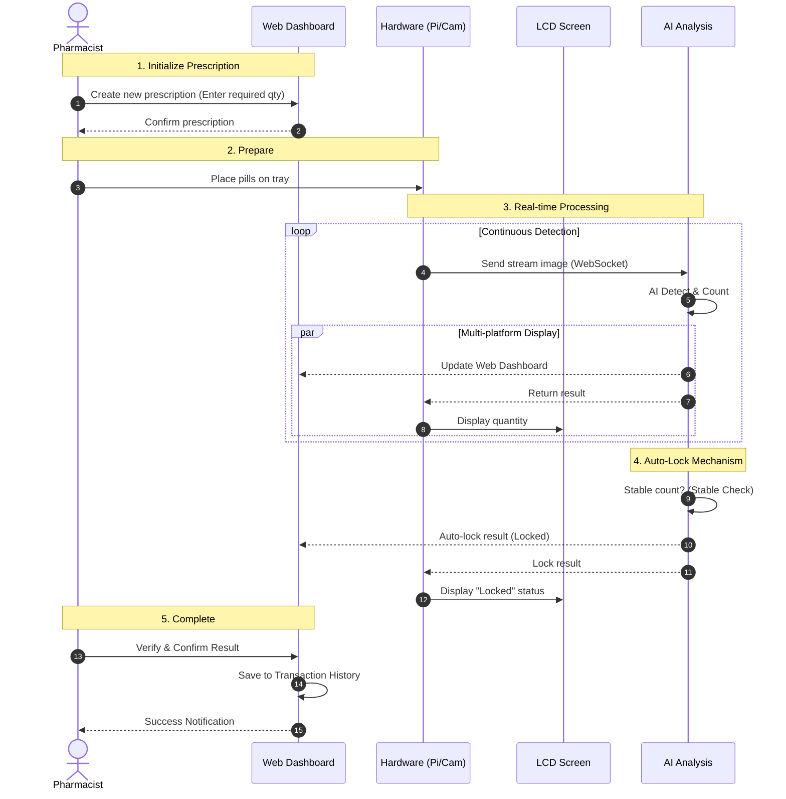

# Pill Counter System - Automated Medication Counting System

> Automated pill counting system using AI technology (YOLOv11) and Raspberry Pi 4, designed to enhance accuracy and operational efficiency in pharmacies.

<p align="center">
  
  
</p>

## Table of Contents

1. [Introduction](#introduction)
2. [Key Features](#key-features)
3. [System Architecture](#system-architecture)
4. [Technologies Used](#technologies-used)
5. [Installation and Deployment](#installation-and-deployment)
6. [User Guide](#user-guide)
7. [Screenshots](#screenshots)
8. [Project Structure](#project-structure)

---

## Introduction

**Pill Counter System** is an integrated hardware and software solution that assists pharmacists in the prescription counting process. The system addresses human error in manual counting while digitizing transaction data for effective inventory management.

**Core Components:**
*   **AI Engine:** Uses a custom YOLOv11 model to detect and count pills with high accuracy.
*   **IoT Device:** Raspberry Pi 4 captures images, displays results on an LCD screen, and performs preliminary processing.
*   **Real-time Processing:** Instant data synchronization between the device and the management server via WebSocket.
*   **Management System:** Centralized Web Dashboard for activity monitoring and reporting.

### Demo Video


---

## Key Features

### For Pharmacists (Operations)
*   Create and manage prescriptions on a digital system.
*   Automatically count pills via monitoring camera.
*   Automatically cross-check actual quantity against prescription requirements.
*   View transaction history and personal performance statistics.
*   Log and report incidents.

### For Administrators (Management)
*   Dashboard for overall data analysis.
*   Manage user accounts and permissions.
*   Manage medication catalog and data inventory.
*   Export performance reports and system logs.

### AI Technical Specifications
*   **Real-time Object Detection:** High response speed.
*   **Auto-locking Mechanism:** Algorithm automatically locks results when the count is stable across a sequence of frames, minimizing manual manipulation.
*   **Confidence Scoring:** Displays the reliability of object detection results.

---

## System Architecture

The system is designed following a Client-Server model with specialized modules:



### Processing Workflow
1.  **Acquisition:** Camera on Raspberry Pi captures image of the pill tray.
2.  **Transmission:** Images are transmitted to Server via secure WebSocket protocol.
3.  **Analysis:** YOLOv11 model analyzes images, detects, and counts pills.
4.  **Verification:** System checks stability (Auto-lock) and automatically resets upon detecting motion (Motion Detection).
5.  **Display & Storage:** Results are displayed on the **Counting Interface** for Pharmacist confirmation, then saved to the database.


*Figure 1: Detailed data flow diagram of the system.*

---

## Technologies Used

### Backend (Server)
*   **Language:** Python 3.8+
*   **Web Framework:** Flask
*   **Database:** MySQL (Using Flask-SQLAlchemy ORM)
*   **Real-time:** Flask-SocketIO
*   **AI/Computer Vision:** Ultralytics YOLOv11, OpenCV

### Frontend (Web)
*   **Interface:** Bootstrap 5, Jinja2 Templates
*   **Visualization:** Chart.js
*   **Communication:** Socket.IO Client

### IoT Device (Edge)
*   **Hardware:** Raspberry Pi 4 Model B
*   **OS:** Raspberry Pi OS (64-bit)
*   **Client App:** PyQt5
*   **Camera:** Module v2 or USB Webcam
*   **Display:** LCD Screen (I2C/SPI) communicating with Pi

---

## Installation and Deployment

### 1. System Requirements
*   **Server:** 4-core CPU, 8GB RAM, GPU (recommended for AI inference).
*   **Client:** Raspberry Pi 4 (4GB RAM or higher).

### 2. Server Setup

```bash
# Clone source code
git clone <repo_url>
cd PILL_COUNTER_PROJECT

# Set up virtual environment
python3 -m venv venv
source venv/bin/activate

# Install dependencies
pip install -r server_app/requirements_server.txt

# Configure environment variables (.env)
cp .env.example .env
# Edit Database info in .env file

# Initialize database
flask db upgrade
flask seed-db

# Run server
python run.py
```

### 3. Workstation Setup (Raspberry Pi)

```bash
# Access Raspberry Pi
ssh pi@<ip_address>

# Install client libraries
cd device_app
pip install -r requirements_pi.txt

# Run client application
python main.py
```

---

## User Guide

### Login
*   **Administrator:** Default account `admin`
*   **Pharmacist:** Account provided by administrator (e.g., `duocsi1`)

### Pill Counting Process
1.  **Create Order:** Pharmacist creates a new prescription on the Web Dashboard.
2.  **Prepare:** Place pills on the counting tray under the camera.
3.  **Process:**
    *   System automatically detects pills.
    *   Results are displayed simultaneously on **LCD Screen** (local) and **Web Dashboard** (remote).
    *   When quantity is stable, system automatically locks the result (Auto-lock).
    *   Pharmacist verifies and clicks confirm.
4.  **Complete:** Data is saved to transaction history.



---

## Screenshots

### Admin Dashboard

*Figure 2: Admin dashboard with overview statistics.*

### Pharmacist Dashboard

*Figure 3: Home interface for pharmacists.*

### Create Prescription

*Figure 4: Interface for creating new prescriptions.*

### Counting Interface (Pharmacist View)

*Figure 5: Main operation screen for pharmacists.*

### Prescription History

*Figure 6: List of completed prescription history.*

### Reports and Statistics

*Figure 7: Performance statistics and activity history.*

---

## Project Structure

```text
PILL_COUNTER_PROJECT/
├── server_app/              # Backend & Web Server Source
│   ├── models.py            # Database Models
│   ├── admin.py             # Admin Logic
│   ├── pharmacist.py        # Pharmacist & AI Logic
│   └── templates/           # User Interface
│
├── device_app/              # IoT Device Source (Client)
│   ├── main.py              # Main Program
│   ├── ai_processor.py      # AI Processing Module
│   └── ui_controller.py     # Device UI Controller
│
├── data_and_training/       # Data & Model Training
│   ├── dataset/             # Raw Images & Labels
│   └── train.py             # YOLO Training Script
│
└── requirements.txt         # Dependency List
```

---

## Additional Information

### Training Dataset
The model is trained on a high-quality dataset of pharmaceutical pill images collected in real-world scenarios and manually labeled, ensuring stable performance under various lighting conditions.


---

## Contributing

This project is developed for research and educational purposes. All contributions from the community are welcome and appreciated.

---

## Authors

**Development Team Members:**

**Nguyen Thanh Huyen**
- GitHub: [@Chizk23](https://github.com/Chizk23)

**Nguyen Thi Bich Uyen**
- GitHub: [@BichUyen2609](https://github.com/BichUyen2609)

**Tran Thi Phuong**
- GitHub: [@PhuongTran2212](https://github.com/PhuongTran2212)

---

**⭐ If you find this project helpful, please give it a star!**
