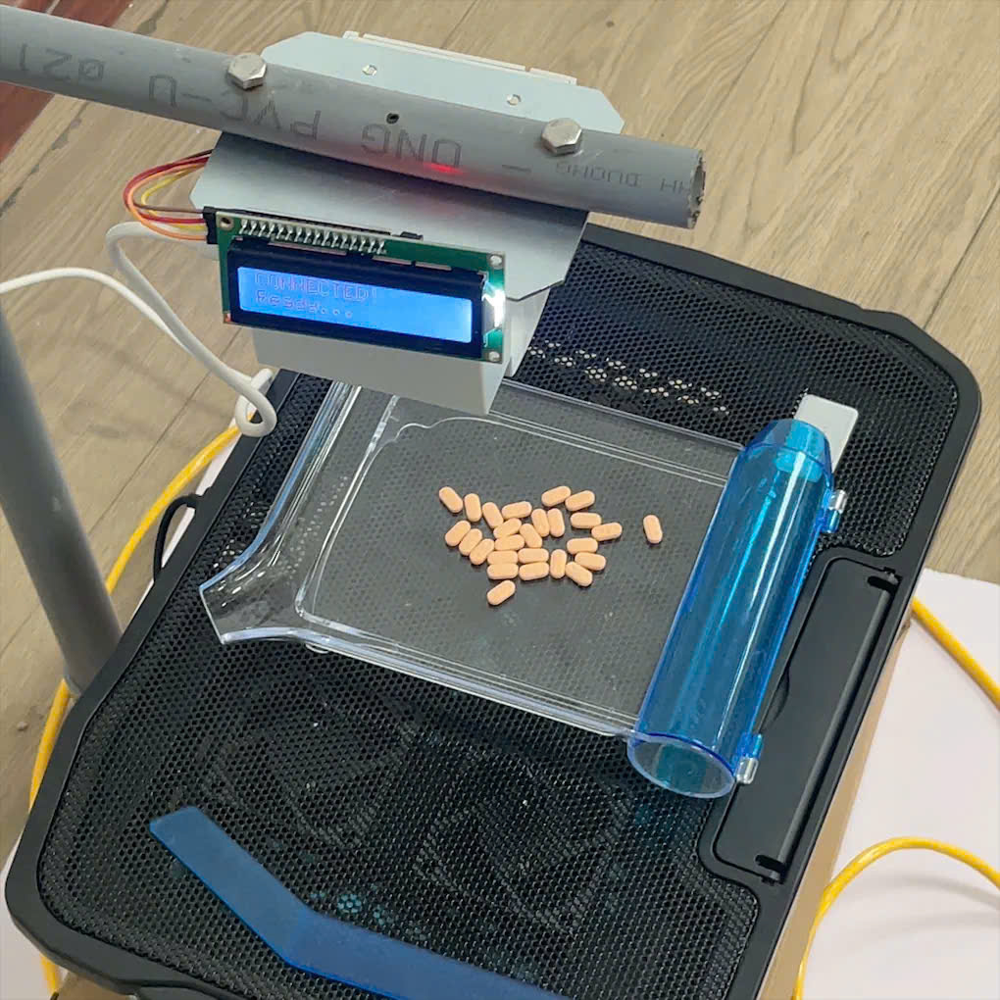
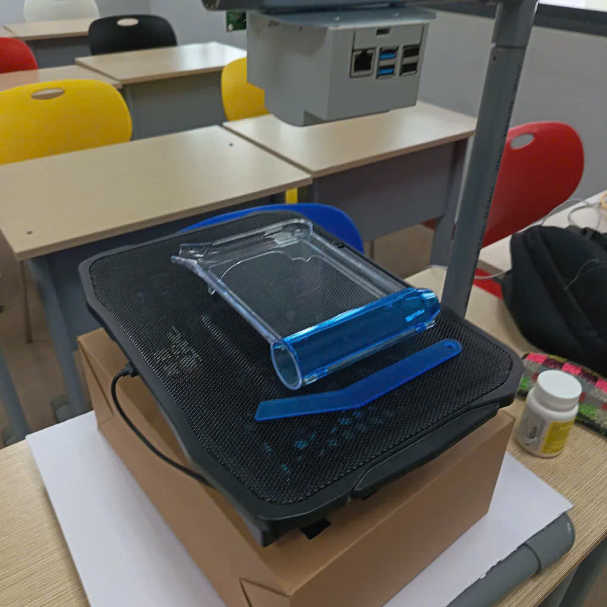
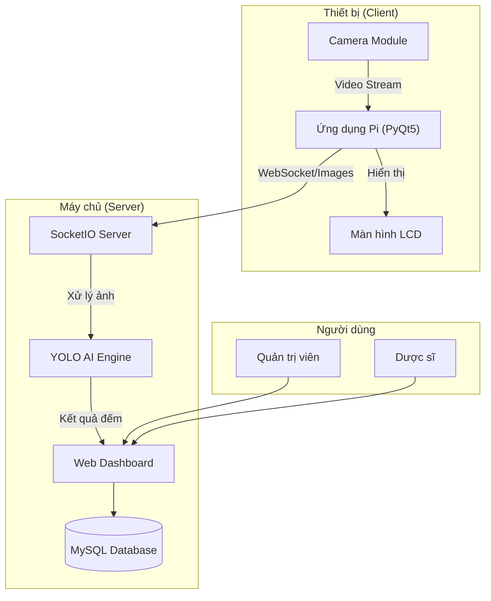
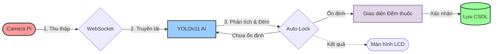
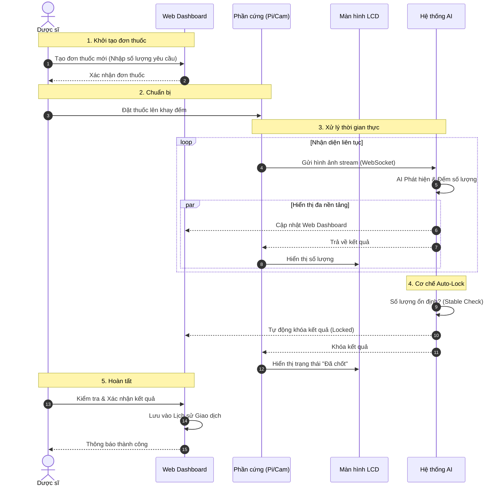
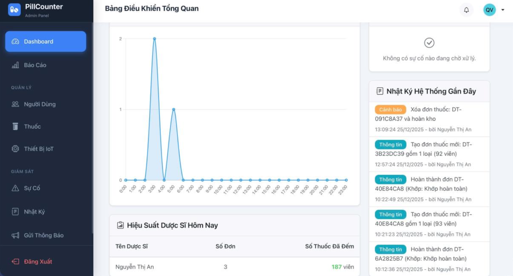
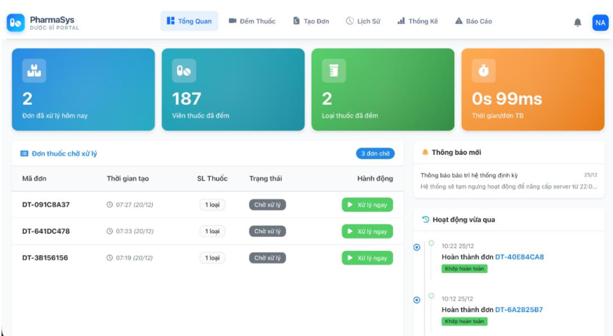
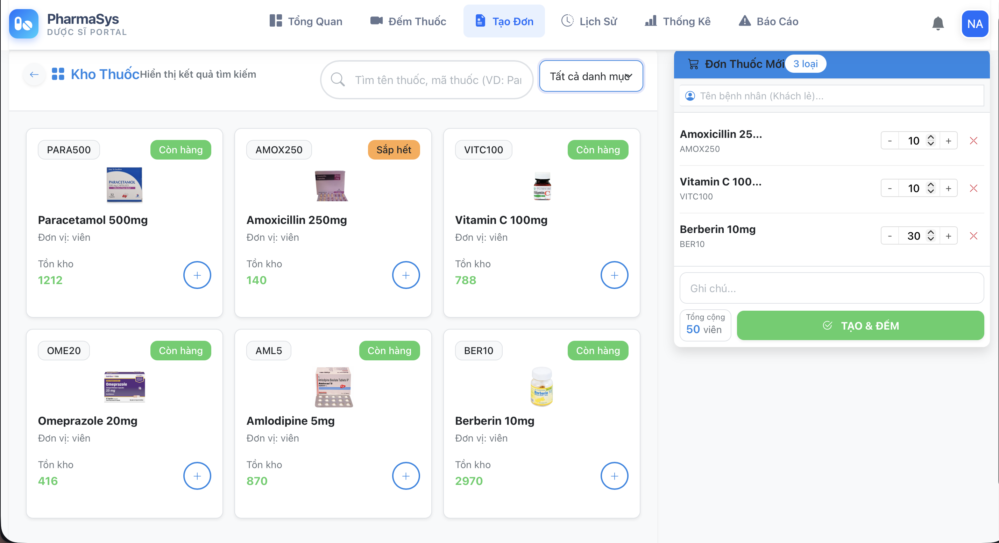
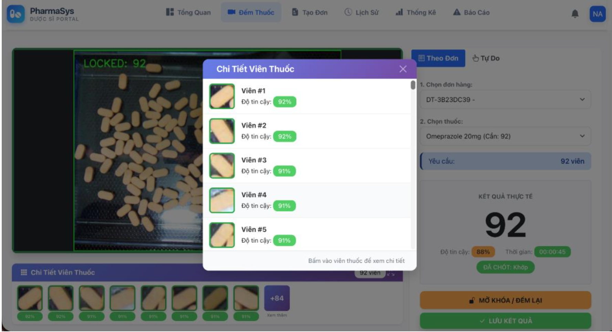
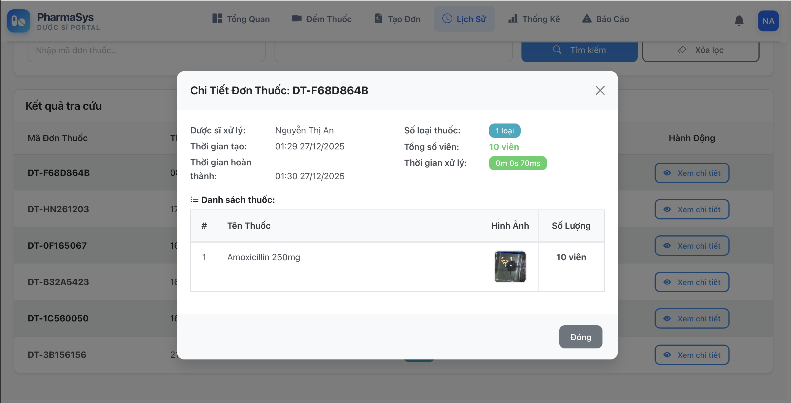

# Pill Counter System - Hệ Thống Đếm Thuốc Tự Động

> Hệ thống tự động hóa kiểm tra số lượng thuốc sử dụng công nghệ AI (YOLOv11) và Raspberry Pi 4, được thiết kế để nâng cao độ chính xác và hiệu quả vận hành tại các nhà thuốc.

<p align="center">
  
  
</p>

## Mục lục

1. [Giới thiệu](#giới-thiệu)
2. [Tính năng chính](#tính-năng-chính)
3. [Kiến trúc hệ thống](#kiến-trúc-hệ-thống)
4. [Công nghệ sử dụng](#công-nghệ-sử-dụng)
5. [Cài đặt và Triển khai](#cài-đặt-và-triển-khai)
6. [Hướng dẫn sử dụng](#hướng-dẫn-sử-dụng)
7. [Hình ảnh minh họa](#hình-ảnh-minh-họa)
8. [Cấu trúc dự án](#cấu-trúc-dự-án)

---

## Giới thiệu

**Pill Counter System** là giải pháp phần cứng và phần mềm tích hợp, hỗ trợ dược sĩ trong quy trình đếm số lượng thuốc theo đơn. Hệ thống giải quyết vấn đề sai sót của con người trong quá trình đếm thủ công, đồng thời số hóa dữ liệu giao dịch để quản lý kho hiệu quả.

**Các thành phần cốt lõi:**
*   **AI Engine:** Sử dụng mô hình YOLOv11 tùy chỉnh để phát hiện và đếm số lượng viên thuốc với độ chính xác cao.
*   **Thiết bị IoT:** Raspberry Pi 4 thu nhận hình ảnh, hiển thị kết quả lên màn hình LCD và xử lý sơ bộ.
*   **Xử lý thời gian thực:** Đồng bộ dữ liệu tức thời giữa thiết bị và máy chủ quản lý qua WebSocket.
*   **Hệ thống quản trị:** Web Dashboard tập trung để giám sát hoạt động và báo cáo.

### Video Demo


---

## Tính năng chính

### Dành cho Dược sĩ (Vận hành)
*   Tạo và quản lý đơn thuốc trên hệ thống kỹ thuật số.
*   Đếm số lượng thuốc tự động thông qua camera giám sát.
*   Tự động đối chiếu số lượng thực tế với yêu cầu trong đơn thuốc.
*   Xem lịch sử giao dịch và thống kê hiệu suất cá nhân.
*   Ghi nhận và báo cáo các sự cố bất thường.

### Dành cho Quản trị viên (Quản lý)
*   Bảng điều khiển (Dashboard) phân tích dữ liệu tổng quan.
*   Quản lý tài khoản người dùng và phân quyền.
*   Quản lý danh mục thuốc và kho dữ liệu.
*   Xuất báo cáo hiệu suất và nhật ký hệ thống.

### Đặc điểm kỹ thuật AI
*   **Phát hiện đối tượng thời gian thực:** Tốc độ phản hồi cao.
*   **Cơ chế Auto-locking:** Thuật toán tự động chốt kết quả khi số lượng đếm ổn định trong chuỗi khung hình, giảm thiểu thao tác thủ công.
*   **Confidence Scoring:** Hiển thị độ tin cậy của kết quả phát hiện đối tượng.


---

## Kiến trúc hệ thống

Hệ thống được thiết kế theo mô hình Client-Server với các module chuyên biệt:



### Quy trình xử lý
1.  **Thu thập:** Camera trên Raspberry Pi ghi nhận hình ảnh khay thuốc.
2.  **Truyền tải:** Hình ảnh được truyền về Server qua giao thức WebSocket bảo mật.
3.  **Phân tích:** Mô hình YOLOv11 phân tích hình ảnh, phát hiện và đếm số lượng viên thuốc.
4.  **Xác thực:** Hệ thống kiểm tra độ ổn định (Auto-lock) và tự động reset khi phát hiện chuyển động (Motion Detection).
5.  **Hiển thị & Lưu trữ:** Kết quả được hiển thị lên **Giao diện Đếm thuốc** để Dược sĩ xác nhận, sau đó mới lưu vào cơ sở dữ liệu.


*Hình 1: Sơ đồ luồng dữ liệu chi tiết của hệ thống.*

---

## Công nghệ sử dụng

### Backend (Server)
*   **Ngôn ngữ:** Python 3.8+
*   **Web Framework:** Flask
*   **Database:** MySQL (Sử dụng Flask-SQLAlchemy ORM)
*   **Real-time:** Flask-SocketIO
*   **AI/Computer Vision:** Ultralytics YOLOv11, OpenCV

### Frontend (Web)
*   **Interface:** Bootstrap 5, Jinja2 Templates
*   **Visualization:** Chart.js
*   **Communication:** Socket.IO Client

### Thiết bị IoT (Edge)
*   **Hardware:** Raspberry Pi 4 Model B
*   **OS:** Raspberry Pi OS (64-bit)
*   **Client App:** PyQt5
*   **Camera:** Module v2 hoặc Webcam USB
*   **Display:** Màn hình LCD (I2C/SPI) giao tiếp với Pi


---

## Cài đặt và Triển khai

### 1. Yêu cầu hệ thống
*   **Server:** CPU 4-core, RAM 8GB, GPU (khuyến nghị cho AI inference).
*   **Client:** Raspberry Pi 4 (RAM 4GB trở lên).

### 2. Thiết lập Máy chủ (Server)

```bash
# Clone source code
git clone <repo_url>
cd PILL_COUNTER_PROJECT

# Thiết lập môi trường ảo
python3 -m venv venv
source venv/bin/activate

# Cài đặt thư viện phụ thuộc
pip install -r server_app/requirements_server.txt

# Cấu hình biến môi trường (.env)
cp .env.example .env
# Chỉnh sửa thông tin Database trong file .env

# Khởi tạo cơ sở dữ liệu
flask db upgrade
flask seed-db

# Khởi chạy server
python run.py
```

### 3. Thiết lập Máy trạm (Raspberry Pi)

```bash
# Truy cập Raspberry Pi
ssh pi@<ip_address>

# Cài đặt thư viện client
cd device_app
pip install -r requirements_pi.txt

# Chạy ứng dụng client
python main.py
```

---

## Hướng dẫn sử dụng

### Đăng nhập
*   **Quản trị viên:** Tài khoản mặc định `admin`
*   **Dược sĩ:** Tài khoản được cấp bởi quản trị viên (ví dụ: `duocsi1`)

### Quy trình đếm thuốc
1.  **Tạo đơn:** Dược sĩ tạo đơn thuốc mới trên Web Dashboard.
2.  **Chuẩn bị:** Đặt thuốc lên khay đếm dưới camera.
3.  **Xử lý:**
    *   Hệ thống tự động phát hiện viên thuốc.
    *   Kết quả được hiển thị đồng thời trên **Màn hình LCD** (tại chỗ) và **Web Dashboard** (từ xa).
    *   Khi số lượng ổn định, hệ thống tự động khóa kết quả (Auto-lock).
    *   Dược sĩ kiểm tra lại và nhấn xác nhận.
4.  **Hoàn tất:** Dữ liệu được lưu vào lịch sử giao dịch.



---

## Hình ảnh minh họa

### Giao diện Quản trị (Admin Dashboard)

*Hình 2: Bảng điều khiển quản trị viên với các thông số tổng quan.*

### Dashboard Dược sĩ (Pharmacist Dashboard)

*Hình 3: Giao diện trang chủ dành cho dược sĩ.*

### Tạo đơn thuốc (Create Prescription)

*Hình 4: Giao diện tạo đơn thuốc mới.*

### Giao diện Đếm thuốc (Pharmacist View)

*Hình 5: Màn hình thao tác chính của dược sĩ.*

### Lịch sử đơn thuốc (Prescription History)

*Hình 6: Danh sách lịch sử các đơn thuốc đã thực hiện.*

### Báo cáo và Thống kê

*Hình 7: Biểu đồ thống kê hiệu suất và lịch sử hoạt động.*

---


## Cấu trúc dự án

```text
PILL_COUNTER_PROJECT/
├── server_app/              # Mã nguồn Backend & Web Server
│   ├── models.py            # Định nghĩa dữ liệu (Database Models)
│   ├── admin.py             # Logic quản trị
│   ├── pharmacist.py        # Logic nghiệp vụ dược sĩ & AI
│   └── templates/           # Giao diện người dùng
│
├── device_app/              # Mã nguồn thiết bị IoT (Client)
│   ├── main.py              # Chương trình chính
│   ├── ai_processor.py      # Module xử lý AI
│   └── ui_controller.py     # Giao diện điều khiển tại thiết bị
│
├── data_and_training/       # Dữ liệu & Huấn luyện mô hình
│   ├── dataset/             # Dữ liệu ảnh thô & nhãn
│   └── train.py             # Script huấn luyện YOLO
│
└── requirements.txt         # Danh sách thư viện
```

---

## Thông tin thêm

### Dữ liệu huấn luyện (Dataset)
Mô hình YOLOv11 được huấn luyện trên bộ dữ liệu thuốc tuỳ chỉnh chất lượng cao, bao gồm:
### Dữ liệu huấn luyện (Dataset)
Mô hình được huấn luyện trên bộ dữ liệu hình ảnh thuốc được thu thập thực tế và gán nhãn thủ công, đảm bảo hoạt động ổn định trong các điều kiện ánh sáng khác nhau.


---

## Đóng góp

Dự án được phát triển phục vụ mục đích nghiên cứu và giáo dục. Mọi sự đóng góp từ cộng đồng đều được hoan nghênh và trân trọng.

---

## Tác giả

**Thành viên nhóm phát triển:**

**Nguyễn Thanh Huyền**
- GitHub: [@Chizk23](https://github.com/Chizk23)

**Nguyễn Thị Bích Uyên**
- GitHub: [@BichUyen2609](https://github.com/BichUyen2609)

**Trần Thị Phượng**
- GitHub: [@PhuongTran2212](https://github.com/PhuongTran2212)

---

**⭐ If you find this project helpful, please give it a star!**
